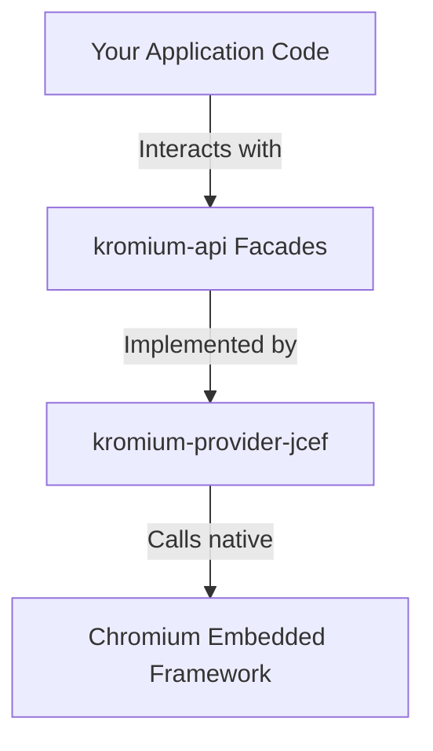

[Documentation Hub](../README.md) / **Core API Reference**

---

# Kromium Core API Reference

The Kromium developer API is 100% provider-agnostic, decoupled from native Chromium/CEF classes, and organized into cohesive domain-driven facades available on the `KromiumBrowser` instance.

---

## API Guides Index

| # | Guide | Primary Facade / Classes | Description |
| :-: | :--- | :--- | :--- |
| **1** | [**Navigation & Reactive State**](navigation.md) | `browser.navigation` `NavigationStage` `KromiumNavigationState` | Loading URLs, history navigation (`goBack`, `goForward`), coroutine suspension until lifecycle stages, and `StateFlow` reactive observation. |
| **2** | [**Web Automation Engine**](automation.md) | `browser.automation` `browser.jsBridge` | Playwright-inspired automation: filling controlled inputs (React/Vue), progressive human typing, element clicking, and `MutationObserver` selector waiting. |
| **3** | [**Interactive Dialogs & Menus**](dialogs-and-menus.md) | `browser.ui` `KromiumJsDialog` `KromiumMenuBuilder` | Intercepting JS `alert`/`confirm`/`prompt`, and building custom right-click context menus with desktop clipboard, devtools, and download actions. |
| **4** | [**Enterprise Networking & Proxies**](network-and-proxies.md) | `browser.network` `browser.security` `KromiumProxy` | HTTP/SOCKS5 proxies with remote DNS, domain bypass lists, runtime dynamic proxy switching, HTTP authentication handlers, and host locking. |
| **5** | [**DevTools, Diagnostics & Logging**](devtools-and-logging.md) | `browser.devTools` `KromiumConsoleMessage` `KromiumLogSeverity` | Standalone Chrome DevTools inspector window, coordinate-based element inspection, structured console interception, and engine C++ log severity. |
| **6** | [**Downloads, Security & Permissions**](downloads-and-security.md) | `client.downloadListener` `KromiumPermissionListener` `SslErrorPolicy` | Intercepting download requests and tracking progress, granting camera/mic permissions, and configuring strict enterprise SSL/TLS policies. |
| **7** | [**Configuration Guide**](configuration.md) | `KromiumConfig` `KromiumClientConfig` | Engine master configuration (sandboxing, cache directories, GPU mode, command-line arguments) and per-client session configuration. |

---

## Architecture Principle: Provider Independence

All interfaces documented here reside in the [`kromium-api`](../../kromium-api) module. Your application code never imports or interacts with JCEF or Chromium classes directly:

---

## Navigation

- [← Previous: Getting Started](../getting-started/README.md)
- [Home: Documentation Hub](../README.md)
- [Next: Deployment & Operations →](../deployment/README.md)
