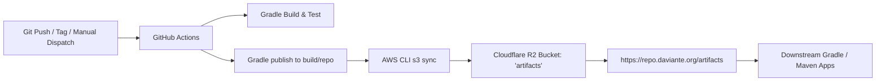

[Documentation Hub](../README.md) / Deployment & Publishing / **Cloudflare R2 Maven Repository**

---

# Cloudflare R2 Maven Repository Guide

This guide documents how Kromium packages are built and published to a self-hosted Maven repository hosted on **Cloudflare R2**, and how downstream consumers configure their build tools to use `https://repo.daviante.org/artifacts`.

---

## 1. Overview & Architecture

Instead of publishing to Maven Central or Bintray, Kromium publishes standard Maven repository layouts directly to Cloudflare R2:



### Why Cloudflare R2?
- **Zero Egress Fees**: Unlike AWS S3, Cloudflare R2 charges **$0 for outbound data transfer**, making it ideal for hosting public or private Maven libraries.
- **S3 Compatible API**: Works seamlessly with standard tools like AWS CLI, MinIO, or S3 clients.
- **Global CDN Caching**: Cloudflare caches POMs, metadata, and JARs globally at the edge for low-latency downloads worldwide.

---

## 2. Cloudflare R2 Setup

### Endpoint and Bucket Details
- **S3 API Endpoint**: `https://d181dcbe77bbb1e89a5cb5f88063d194.r2.cloudflarestorage.com`
- **Account ID**: `d181dcbe77bbb1e89a5cb5f88063d194`
- **Bucket Name**: `artifacts`
- **Public URL**: `https://repo.daviante.org/artifacts`

### Creating Cloudflare R2 API Credentials
To allow GitHub Actions to sync artifacts to R2:
1. Log in to the [Cloudflare Dashboard](https://dash.cloudflare.com/).
2. Navigate to **R2** > **Manage R2 API Tokens**.
3. Click **Create API Token**.
4. Set Permissions: **Object Read & Write**.
5. Scope: Specify the `artifacts` bucket (or all buckets).
6. Click **Create API Token**.
7. Note down the resulting:
   - **Access Key ID**
   - **Secret Access Key**

### Setting Up the Custom Domain (`repo.daviante.org`)
You have two straightforward options in Cloudflare:

#### Option A: Direct Custom Domain on the R2 Bucket (Recommended)
1. Go to **R2** > **Overview** > Click on your `artifacts` bucket.
2. Navigate to **Settings** > **Custom Domains**.
3. Click **Connect Domain** and enter `repo.daviante.org` (or a subdomain).
4. Cloudflare automatically sets up the DNS record and SSL certificate.
   > **Note on URL Path**:
   > - If you map `repo.daviante.org` directly to the `artifacts` bucket, the root URL is `https://repo.daviante.org/`.
   > - If you want the URL path to strictly contain `/artifacts/...` (i.e. `https://repo.daviante.org/artifacts`), set the GitHub repository secret `R2_PREFIX` to `artifacts`. This uploads the files to `s3://artifacts/artifacts/...`.
   > - If you prefer the cleaner root URL `https://repo.daviante.org`, leave `R2_PREFIX` empty.

#### Option B: Cloudflare Worker / Reverse Proxy
If `repo.daviante.org` already serves other content and you want `/artifacts/*` routed to the `artifacts` R2 bucket, create a Worker with an R2 binding:
```javascript
export default {
  async fetch(request, env) {
    const url = new URL(request.url);
    if (url.pathname.startsWith("/artifacts/")) {
      const key = url.pathname.replace(/^\/artifacts\//, "");
      const object = await env.ARTIFACTS_BUCKET.get(key);
      if (!object) return new Response("Not Found", { status: 404 });
      const headers = new Headers();
      object.writeHttpMetadata(headers);
      headers.set("etag", object.httpEtag);
      return new Response(object.body, { headers });
    }
    return new Response("Not Found", { status: 404 });
  }
};
```

---

## 3. GitHub Actions Configuration

### Required Secrets
Add the following secrets in your GitHub repository (**Settings** > **Secrets and variables** > **Actions**):

| Secret Name | Description | Default / Example |
|---|---|---|
| `R2_ACCESS_KEY_ID` | Cloudflare R2 API Token Access Key ID | *(Required)* |
| `R2_SECRET_ACCESS_KEY` | Cloudflare R2 API Token Secret Access Key | *(Required)* |
| `R2_ACCOUNT_ID` | Cloudflare Account ID | `d181dcbe77bbb1e89a5cb5f88063d194` (optional override) |
| `R2_BUCKET_NAME` | Destination R2 Bucket | `artifacts` (optional override) |
| `R2_PREFIX` | Subpath prefix inside bucket | `""` or `"artifacts"` (optional) |

---

## 4. Triggering Releases & Deployments

The workflow `.github/workflows/deploy-r2.yml` supports three triggers:

### 1. Automatic Snapshot Deployment (Push to `main`)
Whenever code is merged into `main`, the pipeline automatically:
1. Runs `./gradlew check` (all tests across all modules).
2. Publishes version `0.1.0-SNAPSHOT` (or value from `gradle.properties`).
3. Syncs artifacts to Cloudflare R2.

### 2. Automatic Release Deployment (Git Tag `v*`)
Pushing a git release tag automatically publishes that exact version:
```bash
git tag v0.1.0
git push origin v0.1.0
```
The workflow strips the `v` prefix and publishes version `0.1.0`.

### 3. Manual Dispatch via GitHub Actions UI
1. Go to **Actions** tab in GitHub.
2. Select **Deploy to Cloudflare R2 Maven Repository**.
3. Click **Run workflow**:
   - **Version to publish**: e.g., `0.2.0-RC1` (leave blank for automatic).
   - **Skip tests**: checkbox to skip `./gradlew check` if previously validated.

---

## 5. Local Verification & Staging

You can test the publication locally at any time without uploading to Cloudflare:

```bash
# Publish artifacts to local directory build/repo/
./gradlew publish

# Or publish with a custom version
./gradlew publish -Pversion=0.2.0
```

Verify the generated repository layout:
```text
build/repo/org/daviante/kromium/
├── kromium-api/
│   └── 0.1.0-SNAPSHOT/
│       ├── kromium-api-0.1.0-SNAPSHOT.jar
│       ├── kromium-api-0.1.0-SNAPSHOT-sources.jar
│       ├── kromium-api-0.1.0-SNAPSHOT.module
│       └── kromium-api-0.1.0-SNAPSHOT.pom
├── kromium-core/
├── kromium-provider-jcef/
├── kromium-javafx/
├── kromium-swt/
├── kromium-swing/
├── kromium-awt/
└── kromium-compose/
```

To manually upload to Cloudflare R2 using the AWS CLI:
```bash
aws s3 sync build/repo s3://artifacts \
  --endpoint-url https://d181dcbe77bbb1e89a5cb5f88063d194.r2.cloudflarestorage.com
```

---

## 6. How Downstream Projects Consume Kromium

### Gradle (Kotlin DSL: `build.gradle.kts` / `settings.gradle.kts`)

```kotlin
repositories {
    mavenCentral()
    maven("https://repo.daviante.org/artifacts")
}

dependencies {
    val kromiumVersion = "0.1.0-SNAPSHOT" // or release version like "0.1.0"

    // Core & Provider
    implementation("org.daviante.kromium:kromium-core:$kromiumVersion")
    implementation("org.daviante.kromium:kromium-provider-jcef:$kromiumVersion")

    // UI Canvas bindings (choose what you need)
    implementation("org.daviante.kromium:kromium-javafx:$kromiumVersion")
    // implementation("org.daviante.kromium:kromium-swt:$kromiumVersion")
    // implementation("org.daviante.kromium:kromium-swing:$kromiumVersion")
    // implementation("org.daviante.kromium:kromium-compose:$kromiumVersion")
}
```

### Gradle (Groovy DSL: `build.gradle`)

```groovy
repositories {
    mavenCentral()
    maven {
        url "https://repo.daviante.org/artifacts"
    }
}

dependencies {
    def kromiumVersion = "0.1.0-SNAPSHOT"
    implementation "org.daviante.kromium:kromium-javafx:${kromiumVersion}"
}
```

### Maven (`pom.xml`)

```xml
<project>
  ...
  <repositories>
    <repository>
      <id>daviante-r2</id>
      <name>Daviante Kromium Repository</name>
      <url>https://repo.daviante.org/artifacts</url>
      <snapshots>
        <enabled>true</enabled>
        <updatePolicy>always</updatePolicy>
      </snapshots>
    </repository>
  </repositories>

  <dependencies>
    <dependency>
      <groupId>org.daviante.kromium</groupId>
      <artifactId>kromium-javafx</artifactId>
      <version>0.1.0-SNAPSHOT</version>
    </dependency>
  </dependencies>
  ...
</project>
```

---

## Navigation

- [← Previous: Configuration Guide](../api/configuration.md)
- [Home: Documentation Hub →](../README.md)
